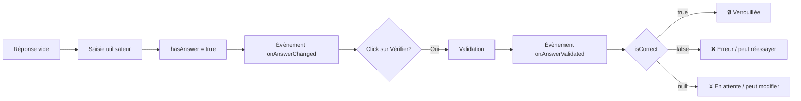

# 📋 Document officiel: Vue StudentWorkEditor
> **Version:** 2.1 | **Dernière mise à jour:** 22/04/2026 | **Auteur:** Référence technique

---

## 🎯 Objectif de la vue

`StudentWorkEditor` est le composant **SOURCE DE VÉRITÉ UNIQUE** pour toute la gestion des réponses étudiantes dans le projet.

✅ Rôles et responsabilités:
- ✅ Gestion native de **TOUS** les types de questions
- ✅ Validation automatique et semi-automatique
- ✅ Gestion des états des réponses
- ✅ Gestion du feedback utilisateur
- ✅ Cycle de vie complet des réponses
- ✅ API et évènements pour intégration avec les autres modules

❌ Ce composant **NE FAIT PAS**:
- ❌ Pas de sauvegarde (il émet seulement des évènements)
- ❌ Pas de gestion de la progression globale
- ❌ Pas de logique métier spécifique

---

## 🧩 Types de questions gérés

| Type de question | `correctionType` | Description |
|---|---|---|
| 🔵 Auto | `auto` | Correction 100% automatique (QCM, Select, Réponse courte) |
| 🟡 Semi | `semi` | Correction partiellement automatique |
| 🟠 Manuel | `manuel` | Correction 100% manuelle par le formateur |
| ⚫ Obligatoire | `obligatoire` | Réponse simple pour participation |

---

## 📊 Tableau de vérité officiel définitif

Ce tableau est la **règle absolue** à respecter en toute circonstance. Toute déviation est un bug.

| Type | Condition | Valeur `isCorrect` | Effet |
|---|---|---|---|
| ✅ `auto` | Réponse correcte | `true` | Question verrouillée, feedback vert ✅ |
| ✅ `auto` | Réponse incorrecte | `false` | Feedback rouge ❌, peut réessayer |
| ✅ `semi` + courte | Réponse dans la liste valide | `true` | Question verrouillée, feedback vert ✅ |
| ✅ `semi` + courte | Réponse pas dans la liste | `null` | Feedback jaune ⏳ en attente |
| ✅ `semi` + ouverte | `minLength` défini **ET** `0 < longueur < minLength` | `false` | Feedback rouge ❌ "Réponse trop courte" |
| ✅ `semi` + ouverte | longueur >= minLength | `null` | Feedback jaune ⏳ en attente |
| ✅ `semi` + ouverte | pas de limite définie | `null` | Feedback jaune ⏳ en attente |
| ✅ `manuel` | **TOUS LES CAS, QUEL QUE SOIT LA RÉPONSE** | `null` | Feedback bleu 📝 en attente |
| ✅ `obligatoire` | Réponse saisie | `true` | Points de participation |

---

## 🎚️ Comportement par mode

### 🟢 Mode Normal (défaut)
| Action | Comportement |
|---|---|
| Réponse saisie | Évènement `onAnswerChanged` |
| Clic sur Vérifier | Validation, évènement `onAnswerValidated` |
| `isCorrect = true` | Question verrouillée définitivement |
| `isCorrect = false` | Peut modifier et réessayer |
| `isCorrect = null` | Peut modifier indéfiniment |

### 🔵 Mode Examen
| Action | Comportement |
|---|---|
| Boutons "Vérifier" cachés | ✅ |
| Sauvegarde automatique en temps réel | ✅ |
| Pas de feedback pendant la saisie | ✅ |
| Tout est verrouillé après rendu | ✅ |

### 🔴 Chapitre rendu / corrigé
| Action | Comportement |
|---|---|
| **TOUS** les champs sont verrouillés | ✅ |
| Aucune modification possible | ✅ |
| Feedback de correction visible | ✅ |

---

## 📋 Champs mis en jeu

### 📥 Champs d'entrée
| Attribut HTML | Description |
|---|---|
| `data-question-id` | Identifiant unique de la question |
| `data-correction-type` | Type de correction (`auto`/`semi`/`manuel`) |
| `data-points` | Nombre de points de la question |
| `onclick` | Contient les paramètres de correction |

### 📤 Champs retournés par `checkQuestion()`
| Champ | Type | Valeurs possibles |
|---|---|---|
| `hasAnswer` | `boolean` | `true` si une réponse est saisie |
| `isCorrect` | `boolean|null` | `true` / `false` / `null` |
| `points` | `number` | Points maximum de la question |
| `userAnswer` | `any` | Valeur brute de la réponse |

---

## 🔄 Cycle de vie d'une réponse

---

## 🔌 API publique

### Méthodes
| Méthode | Description |
|---|---|
| `.init()` | Initialiser le composant sur la page |
| `.checkQuestion(questionEl)` | Vérifier l'état d'une question |
| `.handleAnswer(...)` | Valider une réponse standard |
| `.handleOpenAnswer(...)` | Valider une réponse ouverte |
| `.restoreQuestion(id, data)` | Restaurer l'état d'une question |
| `.lockAllQuestions()` | Verrouiller toutes les questions |

### Évènements
| Évènement | Déclenché quand | Paramètres |
|---|---|---|
| `onAnswerChanged` | Chaque modification de champ | `questionId`, `result` |
| `onAnswerValidated` | Clic sur bouton Vérifier | `questionId`, `answer`, `isCorrect`, `points`, `correctionType`, `needsReview` |

---

## 🛡️ Garanties et contrats

✅ **Contrats immuables**:
1.  ✅ `manuel` retourne **JAMAIS** `true` ou `false`
2.  ✅ Seul `auto` retourne `false` systématiquement
3.  ✅ `isCorrect = false` NE VERROUILLE JAMAIS la question
4.  ✅ Seul `isCorrect = true` verrouille une question
5.  ✅ Les questions ouvertes sont **JAMAIS** verrouillées automatiquement

---

> ✅ Ce document est la référence officielle. Tout comportement qui ne correspond pas à ce tableau est un bug à corriger immédiatement.